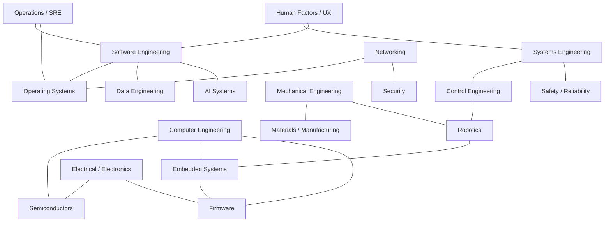

# Domain Relationship Map

```mermaid
flowchart TD
 SE[Software Engineering] --- OS[Operating Systems]
 SE --- DE[Data Engineering]
 SE --- AI[AI Systems]
 CE[Computer Engineering] --- SC[Semiconductors]
 CE --- ES[Embedded Systems]
 EE[Electrical / Electronics] --- SC
 EE --- FW[Firmware]
 ME[Mechanical Engineering] --- MF[Materials / Manufacturing]
 ME --- ROB[Robotics]
 SYS[Systems Engineering] --- CTRL[Control Engineering]
 SYS --- SAFE[Safety / Reliability]
 CTRL --- ROB
 ROB --- ES
 ES --- FW
 FW --- CE
 NET[Networking] --- OS
 NET --- SEC[Security]
 UX[Human Factors / UX] --- SYS
 UX --- SE
 OPS[Operations / SRE] --- SE
 OPS --- OS
```

Edges indicate meaningful intersections, not strict ownership or dependency. Detailed relationships belong in typed concept records.
